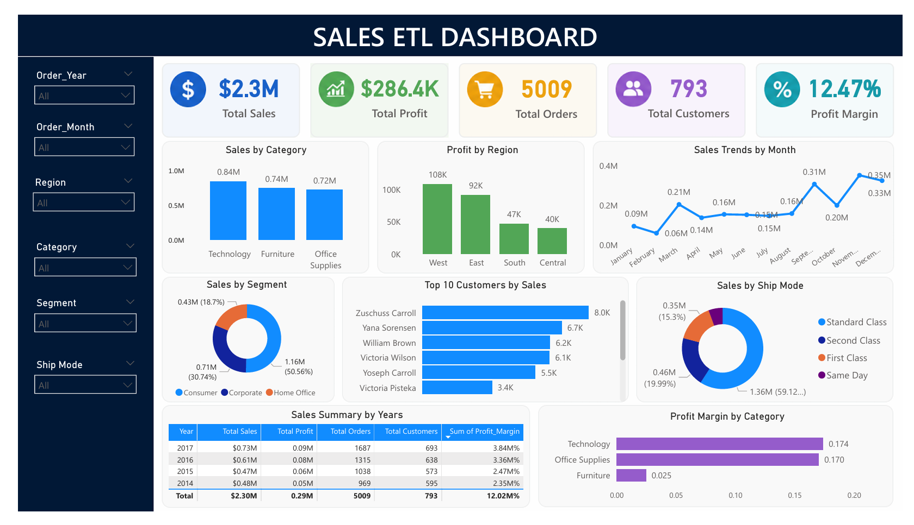

# 📊 Sales Data ETL Pipeline


An End-to-End ETL (Extract, Transform, Load) Pipeline built using **Python**, **PostgreSQL**, **SQL**, and **Power BI** to automate data cleaning, transformation, database loading, and interactive business reporting.

---

## 📌 Project Overview

This project demonstrates a complete ETL workflow using the popular Superstore Sales dataset.

The pipeline performs:

- Extract sales data from CSV files
- Clean and transform data using Python
- Load processed data into PostgreSQL
- Analyze data using SQL queries
- Build an interactive Power BI dashboard for business insights

This project simulates a real-world Data Engineering and Business Intelligence workflow.

---

## 🚀 Features

- Automated ETL Pipeline
- Data Cleaning using Pandas
- PostgreSQL Database Integration
- SQL-based Business Analysis
  
---

# 🛠 Technologies Used

| Technology | Purpose |
|------------|---------|
| Python | ETL Pipeline |
| Pandas | Data Cleaning & Transformation |
| PostgreSQL | Database |
| SQL | Business Analysis |
| Power BI | Dashboard |
| Jupyter Notebook | Development |
| Git | Version Control |
| GitHub | Project Hosting |
- Interactive Power BI Dashboard
- KPI Generation
- Sales Trend Analysis
- Customer & Product Analysis
- Regional Performance Analysis

---

# 🔄 ETL Workflow

CSV Dataset
⬇
Python (Pandas)
⬇
Data Cleaning & Transformation
⬇
PostgreSQL Database
⬇
SQL Business Queries
⬇
Power BI Dashboard
⬇
Business Insights

---

# 📂 Project Structure

```text
SalesData-ETL-Pipeline
│
├── dashboard
│   ├── Sales_ETL_Dashboard.pbix
│   └── dashboard_preview.png
│
├── data
│   └── sample_superstore.csv
│
├── images
│   └── dashboard_preview.png
│
├── notebook
│   └── Sales_ETL.ipynb
│
├── sql
│   ├── schema.sql
│   └── analysis_queries.sql
│
├── README.md
├── requirements.txt
├── LICENSE
└── .gitignore
```

---

# 📈 Dashboard Preview



---

# 📊 Dashboard KPIs

The Power BI dashboard includes:

- Total Sales
- Total Profit
- Total Orders
- Total Customers
- Profit Margin
- Sales by Category
- Profit by Region
- Monthly Sales Trend
- Sales by Segment
- Top 10 Customers
- Sales by Ship Mode
- Profit Margin by Category

---

# ▶️ How to Run

## Clone Repository

```bash
git clone https://github.com/anurag93015/SalesData-ETL-Pipeline.git
```

## Install Dependencies

```bash
pip install -r requirements.txt
```

## Open Notebook

Run:

```
Sales_ETL.ipynb
```

Execute all cells sequentially.

Load the cleaned data into PostgreSQL and open the Power BI dashboard to explore insights.

---

# 📌 Future Improvements

- Automate scheduled ETL jobs
- Add Apache Airflow support
- Integrate cloud databases
- Build Streamlit Web App
- Add Docker support
- Deploy on Azure/AWS
